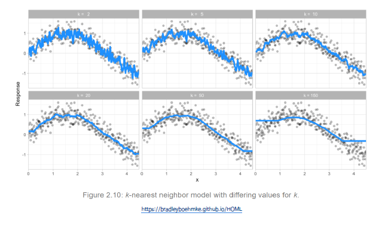
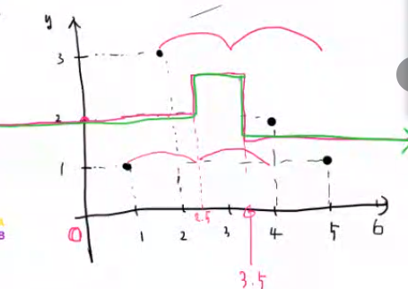

# 2021.10.14 Daily Assignment

###### 기계학습 모델 평가

###### Training Set과 Validation Set을 나누는 방법

###### Bootstraping(복원 추출)

- 여러번 뽑힐 수도 있고 한번만 뽑힐 수도 있다. -> 여러번 할 수 있다.

- Out-of-Bag: Bootstrapping을 진행하는 와중 한번도 나오지 않은 샘플

- Cross Validation이 좀 더 Simple해서 잘 사용한다.

###### 초매개 변수 조절(Hyperparameter tuning)

- 초매개변수는 학습 과정을 제어하는데 사용되는 매개변수를 의미
- 초매개변수는 모델 학습과정이 아닌 모델 개발자에 의해서 지정됨

###### KNN (K-nearest neighbors classification)

- Instance-based learning (데이터에 기반해서 분류를 하는 것), 모델을 찾는 것이 아님

  -> 비 모수적인 방법

- 지도학습으로서 분류(Classification) 나 회귀 (Regression)에 사용되는 비모수적 방법

- 파라메터 학습을 위한 훈련 과정이 없으나 훈련 집합은 필요

- 각 데이터 간에 거리를 계산하기 위한 거리척도가 필요

- 초매개 변수 k를 설정해야함

- 거리에 대한 가중치 

- 붉은 점이 예측 해야 하는 새로운 값이 주어질 때 k와 떨어진 거리를 통해 Class를 구분한다.
- 학습 데이터가 현재는 2가지 종류(label)로 주어져있는데 이는 초매개변수는 아니다. (주어진 데이터의 영역이기 때문이다.)
- 파라매터가 없는 모형이다.
- 결론적으로 k와 거리를 계산하는 방법 두 가지가 초매개변수이다.
- 굉장히 Simple한 방식이다.

###### 기하학적 거리(Geometric distance measuses)

- Minkowski가 일반화 식이다. (q=1 : Manhattan, q=2 : Euclidean)

K =2 일 때 K-NN Regression Line을 그리는 방법

- X축의 값을 0 부터 변화 시켜서 K값만큼 가까운 점의 평균을 통해서 line을 그린다.

- 이 그림을 통해 KNN은 데이터를 초과하는 경우 오차가 계속해서 커지는 것을 알 수 있다.

###### 초매개변수 조절을 위한 격자 탐색 (Grid Search) 알고리즘

- KNN의 경우 왼쪽 k 가 작은 경우는 overfitting이 일어나고 k의 값이 100을 넘어가면 underfitting이 일어난다.

##### KNN에서 거리가 하이퍼 파라매터 중 하나인데 이 거리의 단위 때문에 문제가 발생한다.

예를 들면 X축 값이 땅값이고 Y축이 평수일때 기본적으로 땅 값의 단위가 훨 씬 크다.

데이터:  (Ex 3000만원, 30평)

 이 때 만약 이를 고려하지 않고 거리를 Measure 하면 결과 값이 땅 값에 더 치우쳐지는 현상이 발생한다.

-> **따라서 자료의 전처리가 필수적이다.**

###### 반응변수 전처리 (Target engineering)

- 주로 Parametric model에서 예측 및 모델 적용을 위해서 사용
- e.g. Gaussian distribution, Ordinary linear regression

1. Log transformation
2. Box-cox transformation

###### Log transformation

- 오른쪽으로 치추친 분포 (Right skewed)가 정규 분포로 변환

###### Feature 표준화 (Standardization)

-  각각 feature의 측정 단위에 대한 보정
  - 예) 아파트 값을 추정하기 위한 feature들 중 평수(30평)와 주변 지역의 땅값(3,000,000/평)
- Centering and scaling 을 통해 평균이 0, 표준편차가 1이 되도록 변환 해 줌

###### 결측치 종류

- 무작위 결측칙 (Random missing value)
  - 완전 무작위 결측치(MCAR: Missing Completely At Random)
    - 예) 단순한 결측치
  - 무작위 결측치 (MAR: Missing At Random)
    - 예) 여성(X1)의 경우 체중(X2)에 대한 답이 없음
  - 비무작위 결측치 (NMAR: Not Missing At Random)
    - 체중(X2) 무거운 사람은 체중(X2)에 대한 답이 없음

###### 결측치 대체 (Imputation)

- 결측치를 "최상의 추측"값으로 대체
- Estimated statistic (e.g., Mean, Meadian, Mode, Regression)
- K-nearest neighbor
- Tree-based

RMSE = Root MSE

###### 제로분산 feature (Zero variance features)

제로 분산 features를 판단하는 일반적 기준

- 전체 샘플 중에 서로 다른 관측 값의 비율이 낮은 경우 (약 <= 10%)
- 가장 빈도가 높은 관측값과 두 번째로 높은 관측 값과의 비가 높은 경우 (약 >= 20배)

###### 범주형 데이터 (Categorical feature) engineering

- 재 범주화(Lumping)
- One-hot & dummy encoding
- Label encoding
- Replacing with the mean or proportion

Lumping

- 매우 작은 빈도를 갖는 범주들을 모아서 하나의 범주로 재 범주화

One-hot &  dummy encoding

- 각 범주를 1 또는 0 (True or False)

Label encoding

- 각 범주 자료를 연속형 변수로 바꾸어 표현 (순서형 자료의 경우)

  - e.g) Very high(5), high(4), moderate(3), low(2), very low(1)

  

Replacing with the mean or proportion

- Target encoding is the process of replacing a categorical value with the mean(regression) or proportion (classification) of the target variable.

###### 차원 축소 (Dimension reduction)

-  여러개의 feature에서 불필요한 feature들 제거하는 방법
- 예)주성분 분석 (PCA, principal components analysis)

###### 모델평가 지표 (Model evaluation metrics)

- MSE는 Regression에서 손실함수이면서 동시에 평가 지표가 된다.

x값이 주어지지 않는 데이터가 주어질 때 y의 평균으로 보통 추정하게 되는데 이 때문에 평균의 값이 최선의 모형이다.

###### 분류 모델 (Classification models)

- Misclassification
- Mean per class error
- MSE
- Cross entropy
- Gini Index

###### 모델평가 지표(Model evaluation metrics)

​	1 - Specificty = False positive Rate (FPR)

예제

Recall = 8/(2+8)  , 5/(1+6) = specifity

Precision = 8/(1+8), Negative Predictive Value = 5/(2+5)

Accurracy = (8+5) / (8+2+1+5)

###### ROC (Receiver Operating Characteristic curve)와 AUC (Area under the curve)

- 좋은 분류 모델은 높은 정밀도와 감도를 가지게 되고 오분류율 (위양성 또는 위 음성)을 최소화 함

ROC Example

#### 모델 평가 지표에서는 연속형 자료는 R제곱 ,MSE를 많이 사용하고 범주형은 혼동행렬을 많이 사용한다.

