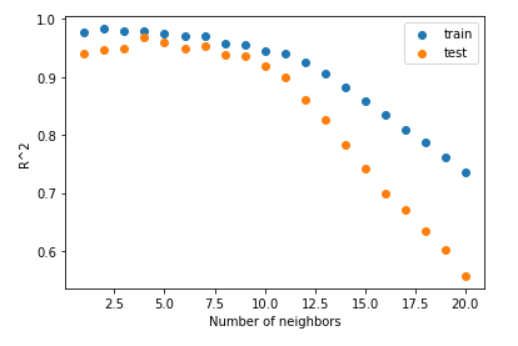

# 2021.10.15 Daily Assignment

##### 작성자: 강명훈


##### KNN Classification

```python
import numpy as np # 매트릭스 연산
import pandas as pd # 엑셀
import matplotlib.pyplot as plt # plot

bream_length = [25.4, 26.3, 26.5, 29.0, 29.0, 29.7, 29.7, 30.0, 30.0, 30.7, 31.0, 31.0, 31.5, 32.0, 32.0, 32.0, 33.0, 33.0, 33.5, 33.5, 34.0, 34.0, 34.5, 35.0, 35.0, 35.0, 35.0, 36.0, 36.0, 37.0, 38.5, 38.5, 39.5, 41.0, 41.0]
bream_weight = [242.0, 290.0, 340.0, 363.0, 430.0, 450.0, 500.0, 390.0, 450.0, 500.0, 475.0, 500.0, 500.0, 340.0, 600.0, 600.0, 700.0, 700.0, 610.0, 650.0, 575.0, 685.0, 620.0, 680.0, 700.0, 725.0, 720.0, 714.0, 850.0, 1000.0, 920.0, 955.0, 925.0, 975.0, 950.0]

plt.scatter(bream_length, bream_weight)

plt.title("Bream, Length vs Weight")
plt.xlabel("Length (cm)")
plt.ylabel("Weight (g)")

plt.show()
```


```python
smelt_length = [9.8, 10.5, 10.6, 11.0, 11.2, 11.3, 11.8, 11.8, 12.0, 12.2, 12.4, 13.0, 14.3, 15.0]
smelt_weight = [6.7, 7.5, 7.0, 9.7, 9.8, 8.7, 10.0, 9.9, 9.8, 12.2, 13.4, 12.2, 19.7, 19.9]

plt.scatter(bream_length, bream_weight)
plt.scatter(smelt_length, smelt_weight)

plt.title("Bream, Smelt")
plt.xlabel("Length (cm)")
plt.ylabel("Weight (g)")

plt.show()
```


###### 데이터 전처리

빙어와 도미의 데이터를 연결 시키고 sklearn에서 처리하기 위해서 2차원으로 변경

```python
length = bream_length + smelt_length
weight = bream_weight + smelt_weight

fish_data = [[l,w] for l, w in zip(length, weight)]
fish_target = [1]*35 + [0]*14
```

Sklearn의 KNN을 이용해서  분석

```python
## sklearn knn module import

from sklearn.neighbors import KNeighborsClassifier

## 객체 생성

kn = KNeighborsClassifier(n_neighbors= 5)

## knn 모델 fitting 
kn.fit(fish_data, fish_target)

## knn model metrics -> confusion metrix를 통해 분류에서는 accuracy가 나온다.
kn.score(fish_data, fish_target) # 결과 값이 1이라는 것은 100퍼센트 분류가 되었다는 것이다.

## prediction
kn.predict([[30, 600]])

plt.scatter(bream_length, bream_weight, s = 100, label = "bream = 1")
plt.scatter(smelt_length, smelt_weight, s = 100, label = "smelt = 0")
plt.scatter(30 , 600, s = 100, label = "New")

plt.title("Bream vs Smelt")
plt.xlabel("Length")
plt.ylabel("Weight")
plt.legend()

plt.show()
```


###### 데이터 세트 분리(Train, Test)

```python
##
train_input = fish_data[:35]
test_input = fish_data[35:]

train_target = fish_target[:35]
test_target = fish_target[35:]

```


###### 샘플링 편향

```python
from sklearn.neighbors import KNeighborsClassifier

kn = KNeighborsClassifier()

kn.fit(train_input, train_target)
kn.score(test_input, test_target)

# 잘못된 훈련 데이터 훈련은 오로지 도미로 했는데 테스트를 빙어 데이터로만 판별을 했다.

index = np.arange(49)
print(index)

np.random.shuffle(index)


train_input = fish_data[index[:35]]
train_target = fish_target[index[:35]]

test_input = fish_data[index[35:]]
test_target = fish_target[index[35:]]

train_input[:5]

plt.scatter(train_input[:, 0], train_input[:, 1])
plt.scatter(test_input[:, 0], test_input[:, 1])
plt.show()
```


```python
kn = KNeighborsClassifier()
kn.fit(train_input, train_target)
kn.score(test_input, test_target)

print(kn.predict(test_input))
print(test_target)
```

###### Data Processing

```python
import numpy as np # 매트릭스 연산
import pandas as pd # 엑셀
import matplotlib.pyplot as plt # plot

## 전체 소스 코드
## https://bit.ly/hg-02-2

fish_length = [25.4, 26.3, 26.5, 29.0, 29.0, 29.7, 29.7, 30.0, 30.0, 30.7, 31.0, 31.0, 
                31.5, 32.0, 32.0, 32.0, 33.0, 33.0, 33.5, 33.5, 34.0, 34.0, 34.5, 35.0, 
                35.0, 35.0, 35.0, 36.0, 36.0, 37.0, 38.5, 38.5, 39.5, 41.0, 41.0, 9.8, 
                10.5, 10.6, 11.0, 11.2, 11.3, 11.8, 11.8, 12.0, 12.2, 12.4, 13.0, 14.3, 15.0]
fish_weight = [242.0, 290.0, 340.0, 363.0, 430.0, 450.0, 500.0, 390.0, 450.0, 500.0, 475.0, 500.0, 
                500.0, 340.0, 600.0, 600.0, 700.0, 700.0, 610.0, 650.0, 575.0, 685.0, 620.0, 680.0, 
                700.0, 725.0, 720.0, 714.0, 850.0, 1000.0, 920.0, 955.0, 925.0, 975.0, 950.0, 6.7, 
                7.5, 7.0, 9.7, 9.8, 8.7, 10.0, 9.9, 9.8, 12.2, 13.4, 12.2, 19.7, 19.9]

fish_data = np.column_stack((fish_length, fish_weight))
#fish_target = [1] * 35 + [0]*14

fish_target = np.concatenate((np.ones(35), np.zeros(14)))

# print(np.shape(fish_data))
# print(fish_target)

```

성능을 확인하기 위해 데이터 셋을 input, test로 나눈다. Target 또한 이에 맞추서 나누는데 이 때 sklearn의 train_test_split()을 이용한다.

```python
from sklearn.model_selection import train_test_split

# train_test_split(*arrays,
#     test_size=None,
#     train_size=None,
#     random_state=None,
#     shuffle=True,
#     stratify=None,)

train_input, test_input, train_target, test_target = train_test_split(
    fish_data, fish_target ,stratify=fish_target, random_state=42)

print(np.shape(fish_data))
print(np.shape(train_input))
print(np.shape(test_input))

print(test_target)
```


```python
## knn
from sklearn.neighbors import KNeighborsClassifier

kn = KNeighborsClassifier()

kn.fit(train_input, train_target)
kn.score(test_input, test_target)

plt.scatter(train_input[:, 0], train_input[:,1])
plt.scatter(25, 150, marker ='^')
plt.scatter(train_input[indicies, 0], train_input[indicies,1], marker='D')
plt.xlabel("Length")
plt.ylabel("Weight")
plt.show()
```


- 직관적으로 보면 가장 가까운 점은 도미 쪽이지만 knn은 주어진 샘플을 빙어라고 판단했다.
- 이런 결과가 나온 이유는 Length와 Weight의 단위가 달라서 상대적으로 큰 Weight쪽으로 가중이 더 되었기 때문이다.

이를 방지하기 위해서 **Feature Scaling**을 실행한다.

```python
## Feature scaling

mean = np.mean(train_input, axis=0) ## 각 열의 평균을 낸다. 
std = np.std(train_input, axis=0) ## 각 열의 표준 편차

## 표준화 (x - xm)/stadard
train_scaled = (train_input - mean) / std

train_scaled[:5]

plt.scatter(train_scaled[:,0], train_scaled[:,1])
plt.scatter(new[0], new[1], marker="^")

plt.show()
```


이를 바탕으로 다시 예측을 시도하면 이전과는 다르게 결과 값이 도미가 나오게 된다.

```python
kn = KNeighborsClassifier()
kn.fit(train_scaled, train_target)

mean_t = np.mean(test_input, axis=0)
std_t = np.std(test_input, axis=0)

test_scaled = (test_input - mean_t)/std_t

dist, indx = kn.kneighbors([new])

plt.scatter(train_scaled[:,0], train_scaled[:,1])
plt.scatter(new[0], new[1], marker="^")
plt.scatter(train_scaled[indx,0], train_scaled[indx,1], marker='D')

plt.show()
```


##### KNN Regression (회귀 분석)

농어의 길이에 따른 무게를 예측해보자

```python
import numpy as np # 매트릭스 연산
import pandas as pd # 엑셀
import matplotlib.pyplot as plt # plot

## 전체 소스 코드
## https://bit.ly/hg-03-1

perch_length = np.array(
    [8.4, 13.7, 15.0, 16.2, 17.4, 18.0, 18.7, 19.0, 19.6, 20.0, 
     21.0, 21.0, 21.0, 21.3, 22.0, 22.0, 22.0, 22.0, 22.0, 22.5, 
     22.5, 22.7, 23.0, 23.5, 24.0, 24.0, 24.6, 25.0, 25.6, 26.5, 
     27.3, 27.5, 27.5, 27.5, 28.0, 28.7, 30.0, 32.8, 34.5, 35.0, 
     36.5, 36.0, 37.0, 37.0, 39.0, 39.0, 39.0, 40.0, 40.0, 40.0, 
     40.0, 42.0, 43.0, 43.0, 43.5, 44.0]
     )
perch_weight = np.array(
    [5.9, 32.0, 40.0, 51.5, 70.0, 100.0, 78.0, 80.0, 85.0, 85.0, 
     110.0, 115.0, 125.0, 130.0, 120.0, 120.0, 130.0, 135.0, 110.0, 
     130.0, 150.0, 145.0, 150.0, 170.0, 225.0, 145.0, 188.0, 180.0, 
     197.0, 218.0, 300.0, 260.0, 265.0, 250.0, 250.0, 300.0, 320.0, 
     514.0, 556.0, 840.0, 685.0, 700.0, 700.0, 690.0, 900.0, 650.0, 
     820.0, 850.0, 900.0, 1015.0, 820.0, 1100.0, 1000.0, 1100.0, 
     1000.0, 1000.0]
     )

plt.scatter(perch_length, perch_weight)
plt.xlabel('length')
plt.ylabel('weight')
plt.show()
```


```python
from sklearn.model_selection import train_test_split

train_input, test_input, train_target, test_target = train_test_split(
    perch_length, perch_weight, random_state=12)

print(train_input.shape, test_input.shape)
test_array = np.array([1,2,3,4])
print(test_array.shape)
test_array = test_array.reshape(2, 2)
print(test_array.shape)

train_input = train_input.reshape(-1, 1)
test_input = test_input.reshape(-1, 1)

print(train_input.shape, test_input.shape)
```

##### 결정 계수 (R^2)

```python
from sklearn.neighbors import KNeighborsRegressor

knr = KNeighborsRegressor()
# k-최근접 이웃 회귀 모델을 훈련합니다
knr.fit(train_input, train_target)

## R^2
print("R^2 of test = ",knr.score(test_input, test_target)) # -> 결정 계수 값 (Regression)
print("R^2 of train = ",knr.score(train_input, train_target))

from sklearn.metrics import mean_absolute_error

# 테스트 세트에 대한 예측을 만듭니다
test_prediction = knr.predict(test_input)
# 테스트 세트에 대한 평균 절댓값 오차를 계산합니다
mae = mean_absolute_error(test_target, test_prediction)

from sklearn.metrics import mean_squared_error

mse = mean_squared_error(test_target, test_prediction)

knr = KNeighborsRegressor()
r2_train = []
r2_test = []
neighbor_n = []

for n in range(1, 21):
    knr.n_neighbors = n
    knr.fit(train_input, train_target)
    r2_train.append(knr.score(train_input, train_target))
    r2_test.append(knr.score(test_input, test_target))
    neighbor_n.append(n)
    
plt.scatter(neighbor_n, r2_train, label = "train")
plt.scatter(neighbor_n, r2_test, label ="test")

plt.xlabel("Number of neighbors")
plt.ylabel("R^2")
plt.legend()

plt.show()
# knr은 n이 작을 수록 오버피팅이다.
```



