# 2021.10.18 Daily Assignment


###### 중회귀, 다항 회귀

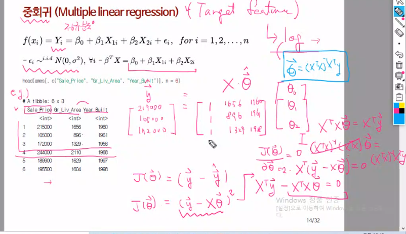

###### 다항회귀 (Poylnomial regression)

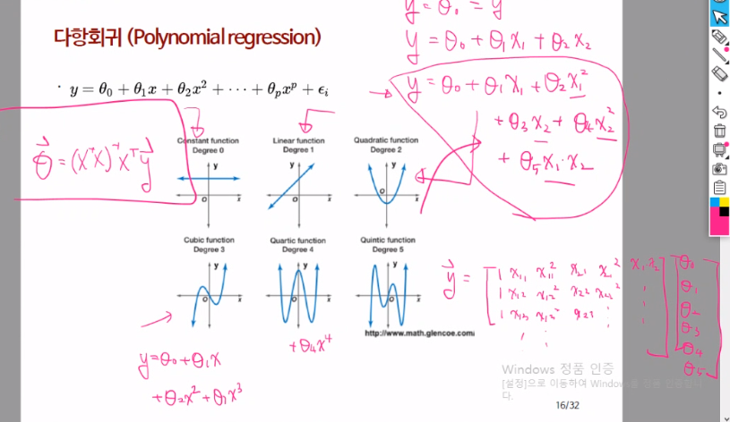

Knr을 이용해서 Classification

```python
import numpy as np
import pandas as pd
import matplotlib.pyplot as plt

perch_length = np.array(
    [8.4, 13.7, 15.0, 16.2, 17.4, 18.0, 18.7, 19.0, 19.6, 20.0, 
     21.0, 21.0, 21.0, 21.3, 22.0, 22.0, 22.0, 22.0, 22.0, 22.5, 
     22.5, 22.7, 23.0, 23.5, 24.0, 24.0, 24.6, 25.0, 25.6, 26.5, 
     27.3, 27.5, 27.5, 27.5, 28.0, 28.7, 30.0, 32.8, 34.5, 35.0, 
     36.5, 36.0, 37.0, 37.0, 39.0, 39.0, 39.0, 40.0, 40.0, 40.0, 
     40.0, 42.0, 43.0, 43.0, 43.5, 44.0]
     )
perch_weight = np.array(
    [5.9, 32.0, 40.0, 51.5, 70.0, 100.0, 78.0, 80.0, 85.0, 85.0, 
     110.0, 115.0, 125.0, 130.0, 120.0, 120.0, 130.0, 135.0, 110.0, 
     130.0, 150.0, 145.0, 150.0, 170.0, 225.0, 145.0, 188.0, 180.0, 
     197.0, 218.0, 300.0, 260.0, 265.0, 250.0, 250.0, 300.0, 320.0, 
     514.0, 556.0, 840.0, 685.0, 700.0, 700.0, 690.0, 900.0, 650.0, 
     820.0, 850.0, 900.0, 1015.0, 820.0, 1100.0, 1000.0, 1100.0, 
     1000.0, 1000.0]
     )

plt.scatter(perch_length, perch_weight)
plt.show()
```

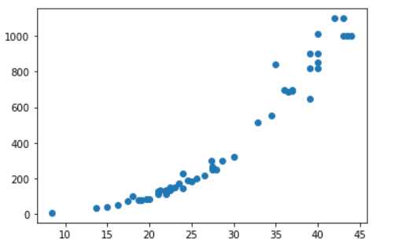

```python
from sklearn.model_selection import train_test_split

train_input, test_input, train_target, test_target = train_test_split(
perch_length, perch_weight)

train_input = train_input.reshape(-1, 1)
test_input = test_input.reshape(-1, 1)

from sklearn.neighbors import KNeighborsRegressor

knr = KNeighborsRegressor(n_neighbors=3)
knr.fit(train_input, train_target)

knr.predict([[50]])
# array([1033.33333333])

dist, indx = knr.kneighbors([[50]])
print(indx)
#[[ 6 40 16]]

plt.scatter(train_input, train_target)
plt.scatter(50, 1033, marker="D")
plt.scatter(train_input[indx], train_target[indx], marker="^", s=100)
plt.show()

```

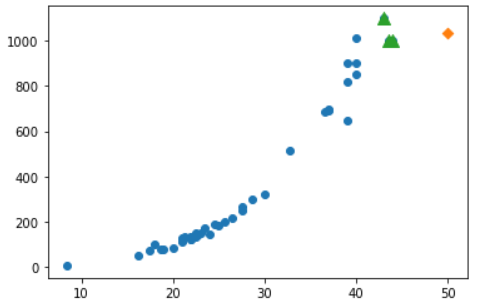

- KNN으로 예측을 했을 때 오차가 심하다.
- 실제로 데이터 셋을 벗어나는 값을 예측하고자하면 오차율이 매우 커지게 된다.
- 이를 해결하고자 선형 회귀 (Linear Regression)을 사용한다.

Linear Regression 

```python
from sklearn.linear_model import LinearRegression

lr = LinearRegression()
lr.fit(train_input, train_target) 
# (length, weight) 세타0 과 세타1을 추정한다. 모델을 만든다.

lr.predict([[50]])
# array([1184.38895275])

print(lr.coef_, lr.intercept_)  # 기울기, 절편

x_new = np.arange(12, 60)
y_new = x_new*lr.coef_ + lr.intercept_

plt.scatter(train_input, train_target)
plt.scatter(50, 1184, marker="^")
plt.plot(x_new, y_new, c="r")
plt.show()
```

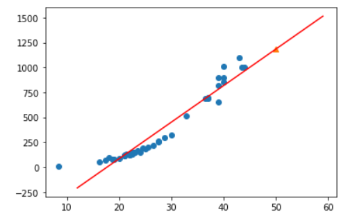

```python
train_input[:10]
# print(train_input.shape)

train_poly = np.column_stack((train_input**2,train_input))
test_poly = np.column_stack((test_input**2,test_input))
# 임시적으로 feature의 제곱 파라매터를 추가해서 더 많은 세타 값을 통해 정확한 그래프 추축

lrp = LinearRegression()
lrp.fit(train_poly, train_target)

x_new = np.arange(10, 50)
y_new = 150.50 - 23.74*x_new  + 1.03*x_new**2


plt.scatter(train_input, train_target)
plt.plot(x_new, y_new, c='r')
plt.show()
```

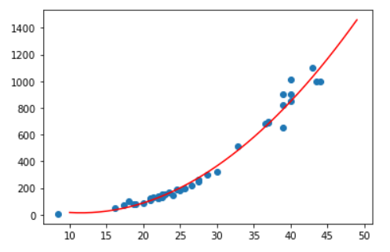

###### Regularization 목적

- 과적합 방지

- 모델 파라메터 수를 조정 (단순한 모델)

  -> 궁극적인 목표는 결국 항(파라매터)의 수를 줄여서 오버피팅을 줄이는 것이다.

###### 주로 사용하는 penalty parameters

- Ridge(L2 Norm)
- LASSO (L1 Norm, Least absolute shrinkage and selection operator)
- Elastic net (L1 + L2 Norm)

###### How to effect on parameter estimation


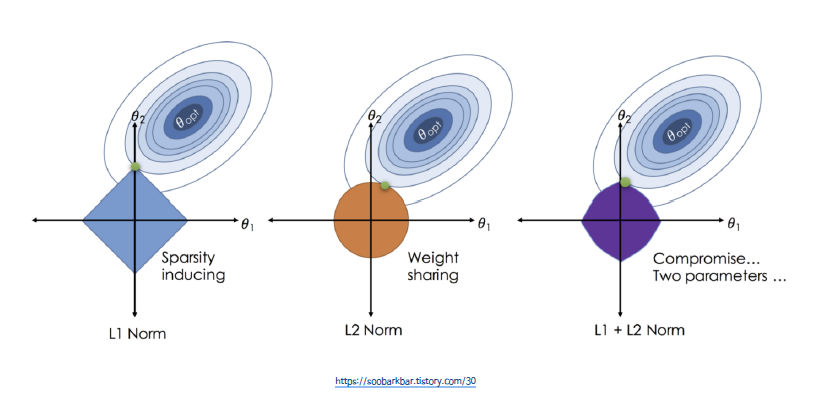

- 페널티가 존재하면 세타의 값을 0으로 보내야 한다. -> 값을 최소화 해야 하기 때문
- 만나는 지점을 기준으로 한다면
  - L2 Norm의 경우는 세타 1과 세타 2가 작은 값이 충족되지만 0은 아니다.
  - L1 Norm의 경우는 세타1은 0 세타 2는 값이 존재한다.
- 람다를 크게 하면 세타opt(OLS 추정량)에서 만나게 될 것이고 람다를 작게하면 OLS추정량에서 멀어지게 될 것이다.

###### Ridge penalty

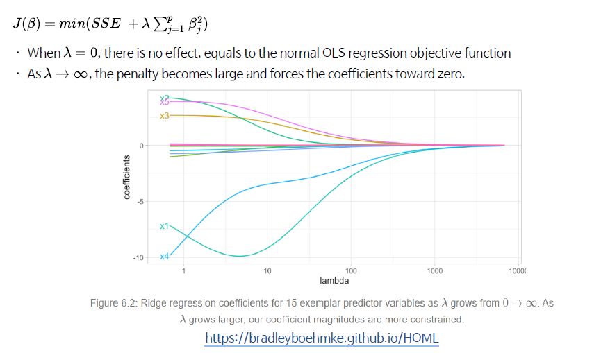

- 값을 작아지게 하려면 결국 세타의 값을 줄여야 한다.
- 람다는 우리가 정하는 하이퍼파라메터
- 람다의 크기에 따라 coefficients가 변화하게 된다.
- 람다의 크기가 거질 수록 파라매터의 크기가 0에 가까워진다.

###### LASSO penalty

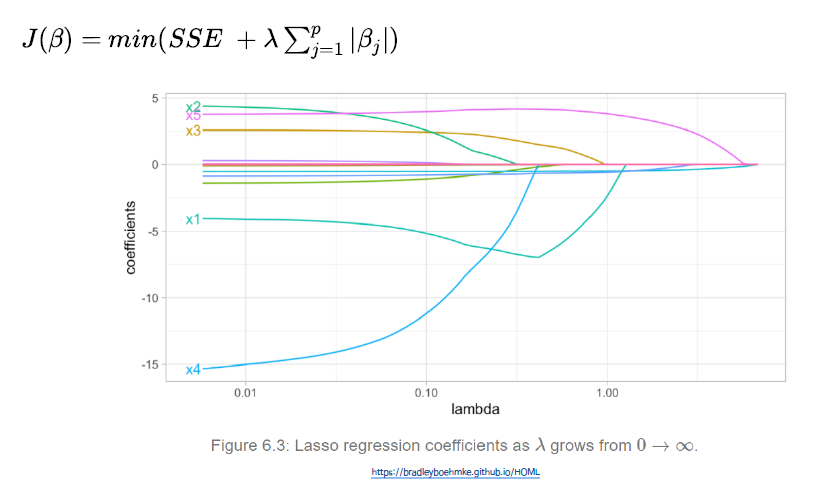

- 람다의 크기가 커지면 중요하지 않는 변수의 값들은 0이되고 의미 있는 값들만 남게 된다.


###### 정규화 예제 코드

농어를 예측해보자

```python
import numpy as np
import pandas as pd
import matplotlib.pyplot as plt

df = pd.read_csv('https://bit.ly/perch_csv')

# print(type(df))

perch_full = df.to_numpy() # df 형태의 데이터를 numpy 형태로 변경
print(type(perch_full))
print(np.shape(perch_full))

perch_weight = np.array([5.9, 32.0, 40.0, 51.5, 70.0, 100.0, 78.0, 80.0, 85.0, 85.0, 110.0,
       115.0, 125.0, 130.0, 120.0, 120.0, 130.0, 135.0, 110.0, 130.0,
       150.0, 145.0, 150.0, 170.0, 225.0, 145.0, 188.0, 180.0, 197.0,
       218.0, 300.0, 260.0, 265.0, 250.0, 250.0, 300.0, 320.0, 514.0,
       556.0, 840.0, 685.0, 700.0, 700.0, 690.0, 900.0, 650.0, 820.0,
       850.0, 900.0, 1015.0, 820.0, 1100.0, 1000.0, 1100.0, 1000.0,
       1000.0])

from sklearn.model_selection import train_test_split
train_input, test_input, train_target, test_target = train_test_split(
perch_full, perch_weight, random_state = 42)
# random_state의 값은 셔플의 시드 값, 다른 값을 넣어도 무관

## polynomial transform
from sklearn.preprocessing import PolynomialFeatures

# 이전에 컬럼 스택 을 이용해서 합치는 방식 처럼 일일이 하기엔 시간과 노력이 많이 필요하기 때문에 이를 쉽게 하기 위해서 작업진행
# 항을 1차항 부터 원하는 차수 까지 변경 시켜서 이를 적용 시켜 보는 것이다. (원하는 차수에 맞춰 degree를 적용 시키면 됨)

poly = PolynomialFeatures(degree =3) ## 최대 차수

poly.fit([[2,3]])   ## feature의 수 와 그 항목을 학습 시킴
poly.transform([[2,3]]) # 예시
# array([[ 1.,  2.,  3.,  4.,  6.,  9.,  8., 12., 18., 27.]])
# 각항의 3제곱 , 2개의 항끼리 곱을 모두 계산해 9개의 파라매터값이 나오게 된다.

poly = PolynomialFeatures(degree =2, include_bias=False) ## 회귀 함수에서 절편을 알아서 넣어주기 때문에 빼는 작업

poly.fit(train_input)

train_poly = poly.transform(train_input)
test_poly = poly.transform(test_input)

poly.get_feature_names()
# ['x0', 'x1', 'x2', 'x0^2', 'x0 x1', 'x0 x2', 'x1^2', 'x1 x2', 'x2^2']

from sklearn.linear_model import LinearRegression

lr = LinearRegression()

lr.fit(train_poly, train_target) # 파라메터 값을 구한다. 현재는 총 10개 (9개 + 절편)

## 
poly = PolynomialFeatures(degree = 5, include_bias= False)

poly.fit(train_input)
train_poly = poly.transform(train_input)
test_poly = poly.transform(test_input)

lr = LinearRegression()
lr.fit(train_poly, train_target)
```

Ridge Regression

```python
from sklearn.preprocessing import StandardScaler

ss = StandardScaler()
ss.fit(train_poly)

train_scaled = ss.transform(train_poly)
test_scaled = ss.transform(test_poly)
# 먼저 각 훈련과, 테스트에 필요한 데이터 값들을 정규화 시켜준다.

from sklearn.linear_model import Ridge

ridge = Ridge()
ridge.fit(train_scaled, train_target)

## Ridge lambda plot
train_score = []
test_score = []

alpha_list = [0.001,0.01, 0.1, 1, 10, 100] 
#람다라고 하기도 한다. 값을 변화를 주어서 최적의 R^2을 찾아보자.

for alpha in alpha_list:
    ridge = Ridge(alpha = alpha)
    ridge.fit(train_scaled, train_target)
    train_score.append(ridge.score(train_scaled, train_target))
    test_score.append(ridge.score(test_scaled, test_target))

plt.plot(np.log10(alpha_list), train_score, label = "Train")
plt.plot(np.log10(alpha_list), test_score, label = "Test")

plt.xlabel("long10(alpha)")
plt.ylabel("R^2")
plt.legend()

plt.show()
```

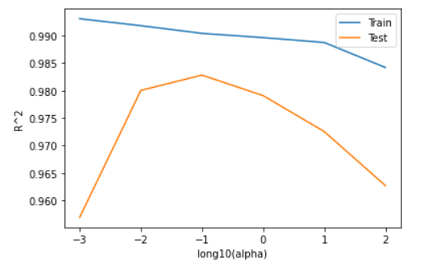

- Y축 값이 R^2이기 때문에 가장 정확한 값은 Alpha가 0.1일 때 이다. (R^2 = 1- SSE/SST)
  - 에러가 작을 수록 값이 커지게 되기 때문

Lasso Regression

```python
from sklearn.linear_model import Lasso

lasso = Lasso()
lasso.fit(train_scaled, train_target)

alpha_list = [0.001, 0.01, 0.1, 1, 10, 100]

ltrain_score = []
ltest_score = []

for alpha in alpha_list:
    lasso = Lasso(alpha=alpha, max_iter=10000)
    lasso.fit(train_scaled, train_target)
    ltrain_score.append(lasso.score(train_scaled, train_target))
    ltest_score.append(lasso.score(test_scaled, test_target))

plt.plot(np.log10(alpha_list), ltrain_score, label = "Train")
plt.plot(np.log10(alpha_list), ltest_score, label = "Test")

plt.xlabel("long10(alpha)")
plt.ylabel("R^2")
plt.legend()

plt.show()
```

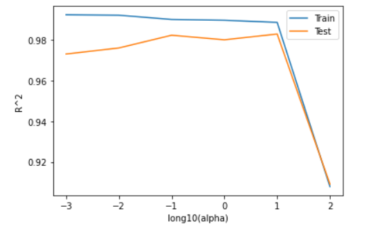

```python
np.sum(lasso.coef_ != 0) # 15
# 55개의 파라미터에서 40개를 제거해서 오로지 15개만 가지고 처리를 했다. -> 파라매터를 줄이고 오버피팅을 줄이게 된다.
```

