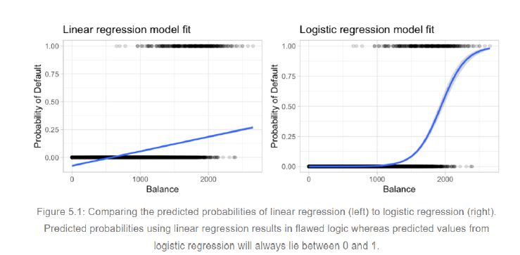
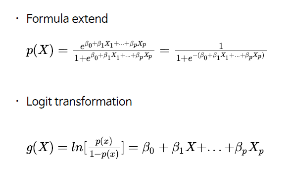
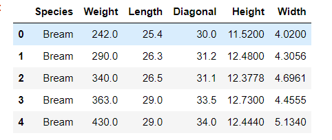
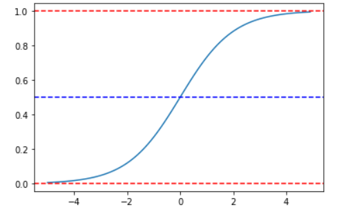
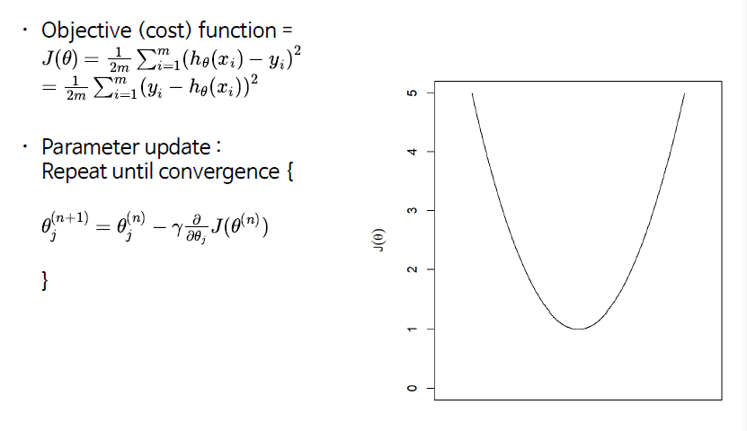
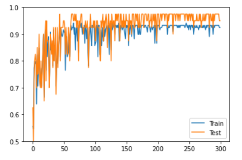
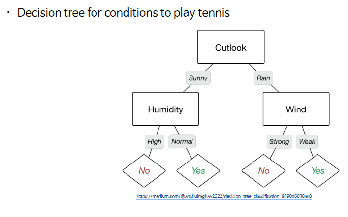
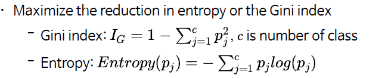
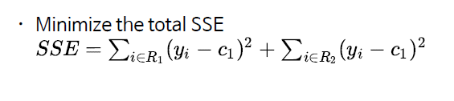

# 2021.10.19 Daily Assignment


###### Logistic regression

- 분류의 문제에 회귀를 적용하는 방법
- 최대 값은 1이되고 최소 값은 0이되며 중앙 값은 완만한 곡선을 그리게 된다.





- 베타(세타) 값이 로지스틱 함수의 기울기를 조절하여 분류하는 범위를 조절 할 수 있다.

###### Logistic Regression Example

```python
import numpy as np
import pandas as pd
import matplotlib.pyplot as plt

fish = pd.read_csv('https://bit.ly/fish_csv')

fish.head()
```



```python
# print(fish.shape)
fish['Species'].value_counts()
# Perch        56
# Bream        35
# Roach        20
# Pike         17
# Smelt        14
# Parkki       11
# Whitefish     6

# sklearn에서 사용하기 위해 numpy로 데이터 건버팅
fish_input = fish[["Weight", "Length", 'Diagonal', 'Height', "Width"]].to_numpy()
# fish_input.head()
# fish_input[:5]
fish_target = fish["Species"].to_numpy()

from sklearn.model_selection import train_test_split

train_input, test_input, train_target, test_target = train_test_split(
fish_input, fish_target, stratify=fish_target)
# 분류에서 각 분류 데이터(종)의 개수가 다 다르기 때문에 이를 조절

print(np.shape(train_input))
print(np.shape(test_input))
# (119, 5)
# (40, 5)

from sklearn.preprocessing import StandardScaler

ss = StandardScaler()
ss.fit(train_input)

train_scaled = ss.transform(train_input)
test_scaled = ss.transform(test_input)

z = np.arange(-5, 5, 0.1)
prob_y = 1/(1+np.exp(-z))

plt.plot(z, prob_y)

plt.axhline(1, linestyle="--", color ="r")
plt.axhline(0, linestyle="--", color ="r")
plt.axhline(0.5, linestyle="--", color ="b")

plt.show()
```

Logistic Estimation에 사용되는 함수의 모양을 한번 보자



```python
# 대표적인 종 2개만 뽑아서 해봄 7개를 다하지는 않음
bream_smelt_index = (train_target == "Bream") | (train_target == "Smelt")

bream_smelt_index

"""
array([False,  True, False, False, False, False, False, False, False,
       False, False, False, False,  True, False, False, False, False,
        True,  True,  True, False, False, False,  True, False, False,
        True, False, False, False,  True,  True,  True, False, False,
       False, False, False, False, False, False, False, False, False,
        True, False, False, False, False,  True, False,  True,  True,
       False, False, False, False, False,  True, False,  True, False,
       False, False, False,  True, False,  True, False, False,  True,
        True,  True, False, False, False, False, False,  True, False,
       False,  True, False,  True, False, False,  True, False,  True,
        True, False, False, False,  True,  True,  True,  True, False,
       False, False, False, False, False, False, False, False, False,
       False,  True, False,  True, False, False,  True, False,  True,
       False,  True])
"""

train_bream_smelt = train_scaled[bream_smelt_index]
target_bream_smelt = train_target[bream_smelt_index]

print(np.shape(train_scaled))
print(np.shape(train_bream_smelt))

# (119, 5)
# (36, 5)

from sklearn.linear_model import LogisticRegression

lr = LogisticRegression()
lr.fit(train_bream_smelt, target_bream_smelt)

lr.score(train_bream_smelt, target_bream_smelt)

# Bream = 0, Smelt = 1
print(train_bream_smelt[:5])

print(lr.predict_proba(train_bream_smelt[:5])) 
# 각 분류 별 확률을 나타낸다. 왼쪽 bream, 오른쪽 smelt에 대한 추측 확률이다.
# 이 중 높은 쪽으로 선택을 하게 된다. 분류 내용이 여러개이면 여러개에 대한 확률을 추측

print(lr.predict(train_bream_smelt[:5]))

"""
[[ 0.24818543  0.08021983  0.24555191  1.19027868  0.46085362]
 [ 1.43826398  0.91278876  1.08643472  2.09959816  1.06901845]
 [ 0.75821909  0.58165339  0.77986286  1.49416309  0.9650541 ]
 [ 0.24818543  0.25051802  0.41197664  1.09119977 -0.07790303]
 [-1.1405229  -1.61330106 -1.62891601 -1.63041741 -1.97263412]]
[[9.84577379e-01 1.54226214e-02]
 [9.99175981e-01 8.24019485e-04]
 [9.96733173e-01 3.26682676e-03]
 [9.79613004e-01 2.03869960e-02]
 [3.40362224e-02 9.65963778e-01]]
['Bream' 'Bream' 'Bream' 'Bream' 'Smelt']
"""


print(lr.coef_, lr.intercept_)

# [[-0.43601526 -0.60100594 -0.68165929 -0.98727992 -0.74633576]] [-2.31347939]

lr = LogisticRegression(C = 20, max_iter = 1000)
# C = 1/lambda

lr.fit(train_scaled, train_target)

print(lr.score(train_scaled, train_target))
print(lr.score(test_scaled, test_target))

# 0.9159663865546218
# 0.925

print(lr.predict(test_scaled[:10]))
print(test_target[:10])

"""
['Bream' 'Perch' 'Perch' 'Perch' 'Roach' 'Perch' 'Perch' 'Roach' 'Bream'
 'Perch']
['Bream' 'Perch' 'Roach' 'Perch' 'Roach' 'Perch' 'Smelt' 'Roach' 'Bream'
 'Perch']
"""

lr.predict_proba(test_scaled[:5]).round(3)
"""
array([[0.996, 0.   , 0.   , 0.   , 0.   , 0.   , 0.003],
       [0.   , 0.001, 0.902, 0.006, 0.076, 0.   , 0.015],
       [0.   , 0.002, 0.631, 0.002, 0.349, 0.001, 0.015],
       [0.   , 0.002, 0.822, 0.002, 0.156, 0.   , 0.018],
       [0.   , 0.021, 0.379, 0.002, 0.57 , 0.01 , 0.018]])
"""

print(lr.classes_)
# ['Bream' 'Parkki' 'Perch' 'Pike' 'Roach' 'Smelt' 'Whitefish']

print(lr.coef_)
print(lr.intercept_)
"""
[[-1.45807018 -1.11515468  2.38448846  7.94367323 -0.97791987]
 [-0.24869832 -1.85102448 -3.45223391  6.67330594 -1.90816875]
 [ 3.09314856  6.5622443  -8.62867271 -6.71641805  4.77687959]
 [-0.30167757  3.68094257  3.98991957 -3.76254216 -1.75577646]
 [-1.93715312 -5.56799903  4.83274372 -1.05836867  2.51420361]
 [-0.99163984  1.12079917  1.2576274  -4.31775621 -5.40980043]
 [ 1.84409046 -2.82980785 -0.38387252  1.23810592  2.76058231]]
[ 0.17954469 -0.26064975  2.7563445  -0.21359135  2.24856918 -7.11511554
  2.40489827]
"""
```

###### 확률적 경사 하강법 (Stochastic gradient descent)

- 다수의 데이터에서 일부를 뽑아서 경사하강법을 적용하기 때문에 확률적 경사 하강법이라 한다.

Iterative optimization



- 미분 기울기의 반대방향으로 움직인다. -> 감마의 크기에 따라 움직이는 크기가 다르다.
- 최소 값 0이 되는 지점을 찾아서 계속해서 parameter optimization을 진행한다.

```python
import numpy as np
import pandas as pd
import matplotlib.pyplot as plt

fish = pd.read_csv('https://bit.ly/fish_csv')

fish_input = fish[["Weight", "Length", 'Diagonal', 'Height', "Width"]].to_numpy()

fish_target = fish["Species"].to_numpy()

from sklearn.model_selection import train_test_split

train_input, test_input, train_target, test_target = train_test_split(
fish_input, fish_target, stratify=fish_target)

from sklearn.preprocessing import StandardScaler

ss = StandardScaler()
ss.fit(train_input)
train_scaled = ss.transform(train_input)
test_scaled = ss.transform(test_input)

from sklearn.linear_model import SGDClassifier

sc = SGDClassifier(loss = "log", max_iter = 100) # logistic regression optimizer
sc.fit(train_scaled, train_target)

# Partial fit
# 새로운 데이터가 들어가야 한다. 하지만 여기서는 새로운 데이터가 들어왔다고 가정하고 같은 데이터 삽입
# 기존의 파라매터 값과 합쳐서 다시 계산
sc.partial_fit(train_scaled, train_target)
print(sc.score(train_scaled, train_target))
print(sc.score(test_scaled, test_target))

classes = np.unique(train_target)
classes

# array(['Bream', 'Parkki', 'Perch', 'Pike', 'Roach', 'Smelt', 'Whitefish'],
#      dtype=object)

sc = SGDClassifier(loss ="log")

train_score = []
test_score = []

for _ in range(0, 300):
    sc.partial_fit(train_scaled, train_target, classes = classes)
    train_score.append(sc.score(train_scaled, train_target))
    test_score.append(sc.score(test_scaled, test_target))
    
    
plt.plot(train_score, label = "Train")
plt.plot(test_score, label = "Test")

plt.ylim(0.5, 1.0)
plt.legend()

plt.show()
```




###### 결정 트리(Decision tree)과 랜덤 포레스트 (Random forest)



###### Gini index



- impurity (불순도)

Feature가 많은 경우 



