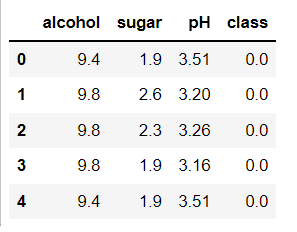

# 2021.10.20 Daily Assignment


###### Decision Tree

- 트리의 가지수가 너무 많아지면 overfitting이 발생한다.  이를 방지하기 위해서 depth를 조절한다.
- 직관적이고 해석하기가 쉽다.
- 하지만 데이터의 의존성이 높아서 tree의 root 또는 internal node를 무엇으로 선택하는지에 따라 모델의 편차가 심하다.
- Gini index를 이용해 가장 좋은 분류 지표를 정한다.
- 회귀 분석의 경우는 SSE를 줄이는 방향으로 Tree를 설계 한다.

```python
import numpy as np
import pandas as pd
import matplotlib.pyplot as plt

wine = pd.read_csv('https://bit.ly/wine-date')
wine.head()
wine.info()
"""
<class 'pandas.core.frame.DataFrame'>
RangeIndex: 6497 entries, 0 to 6496
Data columns (total 4 columns):
 #   Column   Non-Null Count  Dtype  
---  ------   --------------  -----  
 0   alcohol  6497 non-null   float64
 1   sugar    6497 non-null   float64
 2   pH       6497 non-null   float64
 3   class    6497 non-null   float64
dtypes: float64(4)
"""

data = wine[["alcohol", "sugar", "pH"]].to_numpy()
target = wine["class"].to_numpy()

from sklearn.model_selection import train_test_split

train_input, test_input, train_target, test_target = train_test_split(data, target, stratify=target)

from sklearn.tree import DecisionTreeClassifier

dt = DecisionTreeClassifier()
dt.fit(train_input, train_target)

print(dt.score(train_input, train_target))
print(dt.score(test_input, test_target))
# 0.9971264367816092
# 0.8523076923076923

from sklearn.tree import plot_tree

plt.figure(figsize = (10,7))
plot_tree(dt)

plt.show()
```


```python
plt.figure(figsize = (10,7))
plot_tree(dt, max_depth=1, feature_names=['alchol', 'sugar', 'pH'])

plt.show()
```


```python
# pruning 가지치기
dt = DecisionTreeClassifier(max_depth=3, random_state = 42)

dt.fit(train_input, train_target)

print(dt.score(train_input, train_target))
print(dt.score(test_input, test_target))
# 0.8483169129720853
# 0.8424615384615385

plt.figure(figsize= (30, 20))
plot_tree(dt, filled=True ,feature_names=['alchol', 'sugar', 'pH'])
plt.show()
```


```python
dt.feature_importances_  
# 어떤 feature가 tree에 영향을 많이 끼치는지 계산하는 것, 많이 tree가 부정확해질 수록 높은 가중치를 준다.
# feature_name = ['alcohol', 'sugar', 'pH']
# array([0.12983808, 0.86485484, 0.00530708]) -> sugar가 가장 영향을 많이 끼친다.
```


###### Random Forest (RF)

- Bootstrap aggregating (Bagging) + Split-variable randomization

  

###### Cross Validation and Grid Search

```python
import numpy as np
import pandas as pd
import matplotlib.pyplot as plt

wine = pd.read_csv('https://bit.ly/wine-date')
wine.head()
```



```python
data = wine[["alcohol", "sugar", "pH"]].to_numpy()
target = wine["class"].to_numpy()

print(data.shape)
# (6497, 3)

from sklearn.model_selection import train_test_split

train_input, test_input, train_target, test_target = train_test_split(data, target, stratify=target)
# 데이터를 나눌 때 random

from sklearn.tree import DecisionTreeClassifier

dt = DecisionTreeClassifier()

from sklearn.model_selection import cross_validate
from sklearn.model_selection import StratifiedKFold

splitter = StratifiedKFold(n_splits=10, shuffle= True)
# 학습 데이터의 비율이 안맞을 수 있는데 이를 보정하기 위해 사용
score = cross_validate(dt, train_input, train_target, cv = splitter)
# cv : 데이터를 나누는 그룹 수

score['test_score'].mean()
# 0.8641254586461103

print(score)

"""
{'fit_time': array([0.0109899 , 0.01401973, 0.00801063, 0.00899792, 0.00900316,
       0.0079987 , 0.00507641, 0.        , 0.01563931, 0.01561046]), 'score_time': array([0.        , 0.        , 0.        , 0.00099921, 0.00099659,
       0.        , 0.        , 0.        , 0.        , 0.        ]), 'test_score': array([0.8647541 , 0.85245902, 0.85831622, 0.86447639, 0.85215606,
       0.85010267, 0.88911704, 0.86858316, 0.87063655, 0.85010267])}
"""

## 하이퍼 파라매터에 대해서 변화를 주면서 값을 확인
from sklearn.model_selection import GridSearchCV

dt = DecisionTreeClassifier()

papam = {'max_depth':np.arange(4, 20, 1),
        'min_impurity_decrease': np.arange(0.0001, 0.001, 0.001)}

gs = GridSearchCV(dt, param_grid = papam, cv = 10, n_jobs = -1) 
## n_job -> 컴퓨터의 프로세서를 사용 설정

gs.fit(train_input, train_target)
"""
GridSearchCV(cv=10, estimator=DecisionTreeClassifier(), n_jobs=-1,
             param_grid={'max_depth': array([ 4,  5,  6,  7,  8,  9, 10, 11, 12, 13, 14, 15, 16, 17, 18, 19]),
                         'min_impurity_decrease': array([0.0001])})
"""
gs.cv_results_['mean_test_score'] 
# cross validation에 대한 값들 -> 각 depth에 대해 k-fold를 적용하고 나온 값들의 평균
# ex) cv = 5 면 5개로 전체 데이터를 나누어 1개는 test 4개는 train으로만들어 score를 매긴다. 이를 통해 5개의 score가 나오고 
# 이를 평균 내면 해당 depth에 대한 test_score의 평균 값을 구할 수 있다.

dt = gs.best_estimator_ 
# print(dt.score(train_input, train_target)) # 데이터 전체에 대한 값

gs.best_estimator_

# DecisionTreeClassifier(max_depth=19, min_impurity_decrease=0.0001)

print(gs.cv_results_['mean_test_score'])

"""
[0.85447369 0.8604302  0.86165971 0.85755462 0.85796487 0.85858173
 0.86042852 0.85899115 0.85755378 0.85878497 0.85816727 0.86083499
 0.86042557 0.8616555  0.86227236 0.86288753]
"""

plt.plot(gs.cv_results_['mean_test_score'])
plt.xlim(-1,16)
plt.show()
```


###### Random Forest

```python
from sklearn.model_selection import cross_validate
from sklearn.ensemble import RandomForestClassifier
from sklearn.ensemble import GradientBoostingClassifier # 안맞는 데이터 셋에 대해 좀 더 잘 맞게 해준다.


rf = RandomForestClassifier(n_estimators=100, 
                            criterion="gini", 
                            n_jobs = -1)

scores = cross_validate(rf, train_input, train_target,  cv = 10, return_train_score=True)

print(np.mean(scores['test_score']))
print(np.mean(scores['train_score']))

#  0.8918306291446461
# 0.9978790397756118

rf = RandomForestClassifier(n_estimators=100, 
                            criterion="gini", 
                            n_jobs = -1)
rf.fit(train_input, train_target)
print(rf.feature_importances_)
print(wine.columns)

"""
[0.23158333 0.49445426 0.27396241]
Index(['alcohol', 'sugar', 'pH', 'class'], dtype='object')
"""
```

###### K-means clustering

기하학적 거리 측정


유사성을 기반으로 한 측정


- 단순히 거리만으로만 연관성을 찾을 때 예외가 발생할 수 있다. 예를 들어 패턴 (형태)가 비슷한 데이터의 경우 거리는 멀 수 있지만 패턴이 비슷하게 나올 수 있다.

Within-cluster variation

- Cluster를 얼마나 잘 나누었지를 나타내는 척도


```python
import numpy as np
import matplotlib.pyplot as plt

! python -m wget https://bit.ly/fruits_300 -o fruits_300.npy
    
fruits = np.load('fruits_300.npy')
# fruits[0]

plt.imshow(fruits[0], cmap ="gray_r")
plt.show()

print(fruits.shape)
```


```python
fruits_2d = fruits.reshape(-1, 100*100)
print(fruits_2d.shape)
# (300, 10000)

fig, axs = plt.subplots(1,3)
axs[0].imshow(fruits[0], cmap ='gray_r')
axs[1].imshow(fruits[100], cmap ='gray_r')
axs[2].imshow(fruits[200], cmap ='gray_r')

plt.show()
```


```python
from sklearn.cluster import KMeans

km = KMeans(n_clusters=3, random_state = 42)
km.fit(fruits_2d)

# KMeans(n_clusters=3, random_state=42

km_center = km.cluster_centers_.reshape(-1, 100, 100)

print(km_center.shape)
# (3, 100, 100)

fig, axs = plt.subplots(1,3)
axs[0].imshow(km_center[0], cmap ='gray_r')
axs[1].imshow(km_center[1], cmap ='gray_r')
axs[2].imshow(km_center[2], cmap ='gray_r')

plt.show()
```


```python
inertia = []

for k in range(2, 7):
    km = KMeans(n_clusters = k, random_state= 42)
    km.fit(fruits_2d)
    inertia.append(km.inertia_)
    
plt.plot(range(2, 7), inertia)
plt.show()
```


```python
km.predict(fruits_2d[120:121])
# array([0])
```

